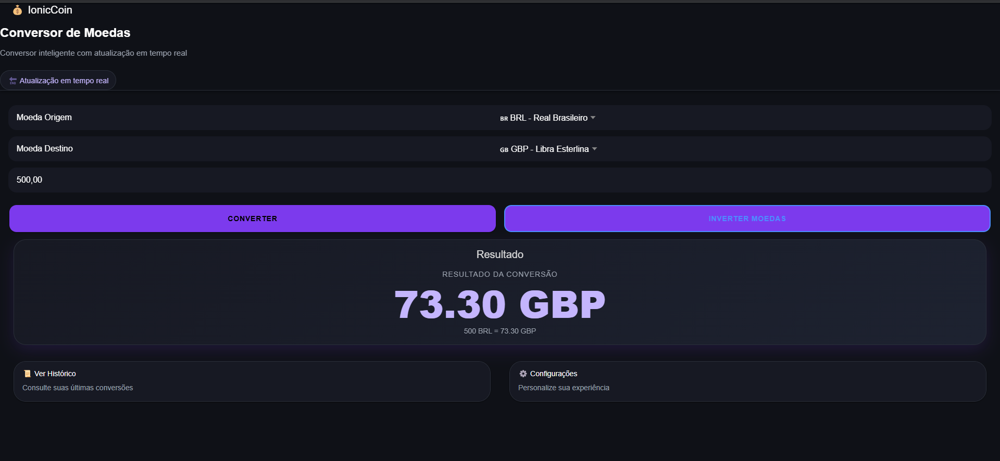
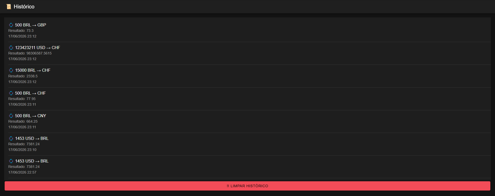
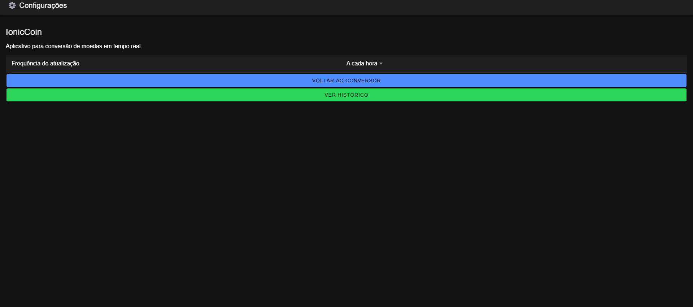

# 💰 IonicCoin

Conversor de moedas desenvolvido com Ionic e Angular, utilizando integração com API REST para obter taxas de câmbio em tempo real.

## 🎓 Informações Acadêmicas

**Instituição:** UNINASSAU

**Curso:** Análise e Desenvolvimento de Sistemas

**Período:** 4º Período

**Disciplina:** Código de Alta Performance - Mobile

**Professor:** João Ferreira

## 📖 Sobre o Projeto

O IonicCoin é uma aplicação mobile desenvolvida para realizar conversões entre diferentes moedas internacionais utilizando taxas atualizadas em tempo real.

O projeto foi construído com foco em desempenho, usabilidade e organização de código, aplicando conceitos de desenvolvimento mobile híbrido com Ionic Framework e Angular.

## 🚀 Funcionalidades

* Conversão de moedas em tempo real
* Integração com ExchangeRate API
* Histórico de conversões
* Limpeza de histórico
* Funcionamento offline utilizando taxas salvas localmente
* Inversão rápida de moedas
* Configurações persistentes com Local Storage
* Interface moderna em Dark Mode
* Suporte a múltiplas moedas internacionais

## 🌎 Moedas Disponíveis

* USD — Dólar Americano
* BRL — Real Brasileiro
* EUR — Euro
* GBP — Libra Esterlina
* JPY — Iene Japonês
* CAD — Dólar Canadense
* AUD — Dólar Australiano
* CHF — Franco Suíço
* CNY — Yuan Chinês
* ARS — Peso Argentino
* MXN — Peso Mexicano

## 🛠 Tecnologias Utilizadas

* Ionic Framework
* Angular
* TypeScript
* HTML5
* SCSS
* ExchangeRate API
* Local Storage

### 📡 Modo Offline

O aplicativo armazena localmente as últimas taxas de câmbio obtidas pela API. Caso não haja conexão com a internet, as conversões continuam funcionando utilizando os dados mais recentes salvos no dispositivo.

## 📸 Capturas de Tela

### Conversor



### Histórico




### Configurações




## ⚙️ Como Executar

Clone o repositório:

```bash
git clone https://github.com/claramatosdt/IonicCoin.git
```

Instale as dependências:

```bash
npm install
```

Execute o projeto:

```bash
ionic serve
```

## 📂 Estrutura do Projeto

```text
src/
├── app/
│   ├── pages/
│   │   ├── converter/
│   │   ├── history/
│   │   └── settings/
│   └── services/
│       └── currency.ts
```

## 👩‍💻 Desenvolvedora

Maria Clara Duarte

Projeto acadêmico desenvolvido para a disciplina Código de Alta Performance - Mobile, do curso de Análise e Desenvolvimento de Sistemas 
Professor : João Ferreira. 

